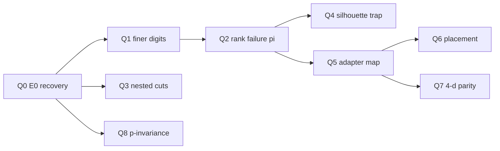

# Foundation

**P-adic clustering of hierarchical paired systems.** Rugby as the falsification platform; PEF as the feature-construction spine. Swansea University.

**Status: normative.** Where this file disagrees with any other document in either worktree, this file wins and the other document is corrected. Written 25 August 2026. UK English throughout.

This document exists because the project's knowledge is split across two idle worktrees that have drifted apart, and because the MATLAB tree itself carries five mutually inconsistent silhouette numbers for the same 1,128 matches. It replaces none of the papers, scripts or logs; it governs them. Its test is operational: an incoming Research Associate should be able to read this file alone and know what to reproduce in week one, what not to cite, and why.

**The rule that shapes every table below.** Each entry carries three fields: *what it is*, *why it is that way*, and *what it obliges someone to do*. An entry that cannot fill the third field is background reading, and belongs in a citation rather than a row.

**Citation convention.** Author–year throughout, because compiled `[n]` numbering does not yet exist and a stale number here would propagate. The prior-art ledger (§3) is the sync source when a numbered bibliography is introduced.

**Path convention.** Paths beginning `docs/`, `data/`, `pipeline/`, `validation_results_*` or `*.m` are relative to this repository (`p-adic-systems`).

- `MATLAB/` = this repository's `.m` scripts (audit of the 2025 runs)
- `PIPELINE/` = `pipeline/padic_pef/` (canonical Python, copied from the off-shoot on 25 August 2026)
- `OFFSHOOT/` = `/Users/rowanbrown/Documents/Claude/Projects/p-adic applications in sport/` (archive; do not edit in parallel)
- `DATA/` = `data/rugby/rugby_analysis_ready.csv`
- `PAPERS/` = `docs/Paper/`

The April–June 2026 off-shoot's pipeline, methodology note, review, OSF draft, protocol and progress log now live in this repository (`pipeline/`, `docs/`). Initialise git here before any further merge. The Claude folder is an archive.

---

## 0. Precedence and scope

| Rank | File | Governs |
|---|---|---|
| 1 | **This file** | Object definition, parameters, distance convention, tiers, rulings |
| 2 | `docs/methodology_note_PEF_padic_bridge.md` | PEF → encoding → expected-silhouette derivation, subordinate to §1, §5 and §6 here |
| 3 | `docs/p-adic_review_and_extensions.md` | Positioning, literature, extensions |
| 4 | `docs/OSF_preregistration.md` | Health-pilot hypotheses, unsubmitted |
| 5 | `docs/offshoot_PROGRESS_LOG.md` | Off-shoot session state; stale where it treats 0.7083 as known truth |
| 6 | `PAPERS/padic_rugby_latex.tex` | Perfect-to-practical narrative |
| 7 | `PAPERS/padic_rugby_latex_enhanced.tex` | Fragment claiming 0.7083 and 126.7% lift |
| 8 | `enhanced_padic_rugby_pipeline.m` | Reference MATLAB encoding that *claimed* 0.7083 |
| 9 | `validation_results_phase{1,2,3}*/` and `pipeline/results/matlab_reproduction.md` | Empirical record, including failures and the 25 Aug 2026 Python D2 run |
| 10 | `pipeline/padic_pef/` | Canonical implementation. Rugby ingest and `legacy_d2` exist. NHS-SOF / WIMD still stubs |

Ranks 5, 6 and 7 have a specific hazard: all three still present silhouette 0.7083 as an established real-data result. That number was **not recovered** on the current CSV under a faithful D2 port (ruling R12). Rank 10's `cluster.py` now documents D3; D2 lives only in `legacy_d2.py`.

---

## 1. The object of study

### 1.1 Definition

Fix a finite set of entities $E = \{e_1,\dots,e_N\}$ and a finite set of metrics $k = 1,\dots,K$. Each entity is observed through **paired measurements** $(X_{A,k}(e), X_{B,k}(e))$, where $A$ is the entity and $B$ is a designated counterpart (opponent, regional peer, local-authority mean). A **hierarchical paired system** is this collection together with a distinguished outcome label $Y$, in which the *meaningful* distance between two entities is dominated by the highest organisational level at which they differ.

Three properties define the class, and each one is load-bearing.

**Ultrametric hierarchy.** If $e_i$ and $e_j$ first disagree at level $\ell$, no agreement at finer levels can pull them closer. This is the ultrametric inequality $d(x,z) \le \max\{d(x,y), d(y,z)\}$, and it is why a p-adic (or any ultrametric) distance is not an arbitrary substitute for Euclidean distance. Remove it and the project is ordinary clustering of a hand-weighted feature vector.

**Paired measurements.** Absolute and relative features are not two styles of writing the same table. Whether $X_A$ or $X_A - X_B$ carries the signal is an empirical question, answered per metric by the Paired Efficiency Factor (PEF). A single unpaired cloud, or two co-located but non-paired populations, is a different problem — that is the topology grant, not this one.

**Defensible categorisation.** Continuous metrics are mapped to digits of a base-$p$ address. This is not a preprocessing convenience: it is what makes the entity a p-adic integer rather than a point in $\mathbb{R}^K$. Whether a new system admits a defensible discretisation (natural tiers, policy thresholds, or equal-frequency bins with a stated $p$) is a question, not an assumption; see the O1 gate in §2.3.

Rugby is the only setting in hand that supplies a full population of adversarially paired trajectories, with expert-readable cluster labels. It is the falsification platform, not the contribution. The framework transfers to any hierarchical paired system *once PEF is re-estimated and the digit schedule is re-derived* — that qualifier travels with the claim, always.

### 1.2 The derived chain

Every quantity in this project is one of seven objects, produced in this order. The chain is fixed; disputes about a number are disputes about a stage of it.

| Stage | Object | Produced by |
|---|---|---|
| 1 | Paired table $(X_{A,k}, X_{B,k})$ | Match-level abs/rel columns; or trust–peer / LSOA–LA pairing |
| 2 | PEF record $(\hat\kappa_k, \hat\rho_k, \hat\eta_k, I(X_k;Y))$ | `pipeline/padic_pef/pef.py` |
| 3 | Feature $f_k \in \{X_{A,k},\, X_{A,k}-X_{B,k}\}$ | Quadrant rule, §2.2 |
| 4 | Digit $d_k \in \{0,\dots,b-1\}$ | Equal-frequency quantile binning, $b = 2^p$ in the note, $b=4$ in MATLAB |
| 5 | Address $\mathbf{d}(e) = (d_1,\dots,d_K)$ | Dimensions ordered by descending $I(X_k;Y)$ |
| 6 | Distance $D_{ij} = d_p(\mathbf{d}(e_i), \mathbf{d}(e_j))$ | **D3**, the position-based p-adic metric of §2.5 |
| 7 | Inference | Hierarchical clustering, silhouette, external $Y$ |

Homology, landscapes and CUSUM are out of scope. They belong to the competitive-collectives grant. This project clusters addresses; it does not persist filtrations.

Four distance functions exist in the two trees. Only D3 is licensed going forward.

| Code | Where | What it actually computes | Status |
|---|---|---|---|
| **D0** | `rugby_padic_functions.m` | True p-adic norm of a rational approximation to $x_i - y_i$, then max over components | Implemented; unused by the headline pipeline |
| **D1** | `perfect_padic_rugby_optimized.m` | Weighted max of *scaled component differences*. Ultrametric by taking max. Not a p-adic valuation | Synthetic only. Do not call it p-adic in a paper |
| **D2** | `enhanced_padic_rugby_pipeline.m` | $\max_k p^{-v_p(\lvert f_{ik}-f_{jk}\rvert)}$ with a special case: any difference $\ge 10{,}000$ is forced to distance 1 | Produced 0.7083. Audit reference only |
| **D3** | `pipeline/padic_pef/cluster.py` | $d = p^{-k^*}$ where $k^*$ is the first digit position at which the two addresses disagree (most-significant first). Weights order the digits; they are not exponents | **Canonical.** The MATLAB $w_k$ as exponent underflows at lex-rescaled $I(X;Y)$ (off-shoot bug 2) |

Formally, for addresses in most-significant-first order,

$$d_p(\mathbf{d}, \mathbf{d}') = \begin{cases} 0 & \text{if }\mathbf{d}=\mathbf{d}', \\ p^{-k^*} & \text{if }k^*=\min\{k : d_k \ne d'_k\}. \end{cases}$$

This is the standard p-adic metric on digit strings. It is *not* the weighted max-norm of D1, and it is *not* D2's special-case valuation on the raw weighted features.

### 1.3 What is defined but out of scope

A **role variable** (possession, attacker/defender, trust/peer direction) is defined so that the Standard Grant / health-pilot architecture has a referent, and so that nobody reintroduces it into the rugby paper's clustering by accident. Clustering is on entity-level aggregates. Match-level role inversion is a different object.

**Talent-pathway and tournament-bracket encodings** are defined in the review (§3 of rank 3) and are data-access-dependent. *Action.* Do not use academy or bracket claims in any rugby deliverable.

**Khrennikov ultrametric diffusion** is defined so that the health-pilot social-barrier parameter has a name. *Action.* Do not cite it as a result of this project. It is a proposed estimator, not an estimate.

---

## 2. Parameter register

Status codes: **M** measured from data; **C** chosen by convention with a stated reason; **G** gated, i.e. re-derived and tested during the next run; **S** synthetic only; **X** defined but out of scope.

### 2.1 System and sampling

| Parameter | Value | Status | Why | Action it obliges |
|---|---|---|---|---|
| Entities $N$ | **16 teams** | M | Complete URC/Pro14-era panel in `DATA/` | Do not drop teams to chase silhouette. $N=16$ is the population, and it is small; every power claim must say so |
| Matches | **1,128 rows**, 564 fixtures (each match appears twice) | M | Seasons 21/22–24/25: 282, 280, 284, 282 | Quote 1,128 as *team-match rows*, never as 1,128 independent fixtures |
| Seasons | 21/22, 22/23, 23/24, 24/25 | M | Four complete seasons in the CSV | Leave-one-season-out is the external check; it is not optional |
| Unit of analysis | **The team**, features averaged over that team's matches | C | The two rows of a fixture are maximally dependent. Clustering match rows would treat opponents as independent samples of the same cloud | State the unit in any silhouette or power claim. Never treat 1,128 as the sample size for clustering |
| Outcome $Y$ | Match `outcome_binary` at row level; undefined at team level without a further rule | G | PEF needs $Y$ for $I(X;Y)$. MATLAB never computed PEF | Lock a team-level $Y$ before the PEF run: season win rate, or binarised points-difference sign. Record the choice here |
| Perfect system $N$ | 16 synthetic teams, 4 tiers $\times$ 4 | S | Hierarchical Dominion construction | Never mix these 16 with the 16 URC names |

### 2.2 Feature encoding (MATLAB headline, then PEF replacement)

The single most error-prone table in the project. Read the last row before using any value.

| Scale / digit | MATLAB value | Status | Why this value | Action |
|---|---|---|---|---|
| Performance tier | $w=10{,}000$; bins on mean `final_points_relative`: $>10$ Elite, $>2$ Strong, $>-5$ Competitive, else Developing | C | Hand-set so the first digit dominates | Present as a judgement call. Presenting it as a data-derived optimum is the single easiest way to lose a methods referee |
| Attacking style | $w=100$; `abs_carries / (abs_passes+1)` at 0.8 / 0.6 / 0.4 | C | Abs chosen by intuition (capability) | Re-place on the $(\kappa,\rho)$ plane under PEF. The intuition is the Q1/Q2 special case, not a result |
| Breakdown | $w=50$; rel turnover differential at $\pm 2$, $0$ | C | Rel chosen by intuition (dominance) | As above |
| Territory | $w=25$; `abs_kicks_from_hand` at 20 / 15 / 10 | C | Abs | As above |
| Penetration | $w=12$; `rel_clean_breaks` at 2 / 0 / $-1$ | C | Rel | As above |
| Discipline | $w=6$; `rel_penalties_conceded` at $-2$, $0$, $2$ | C | Rel; sign flipped so low penalties score high | As above |
| Set piece | $w=3$; `abs_scrums_won + abs_lineout_throws_won` at 25 / 20 / 15 | C | Abs | As above |
| Prime sweep | MATLAB $\{2,3,5,7\}$; note adds $\{11,13\}$ | C | $p=2$ won the MATLAB sweep | Report the whole sweep. "Optimal $p=2$" without the table is a claim the sweep does not yet support in public |
| Linkage | MATLAB **complete**; off-shoot sweeps single / complete / average | C / G | Complete was the MATLAB default; single linkage is the ultrametric-natural choice and chains on ties | Sweep all three; select by silhouette; name the winner. Do not silently switch |
| **Do not use: $w_k$ as a p-adic exponent** | — | — | Lex-rescaled $I(X;Y)$ of order $10^3$ makes $2^{-w_k}$ underflow to 0 (off-shoot bug 2). D2's $\ge 10{,}000 \mapsto 1$ is a patch for the same problem | **Cluster with D3.** An RA reading the methodology-note formula unaided will otherwise implement D2-with-underflow and reproduce nothing. See ruling R6 |

**PEF replacement (gated, not yet run on rugby).**

$$\kappa = \frac{\sigma_B^2}{\sigma_A^2},\qquad \eta = \frac{1+\kappa}{1+\kappa - 2\sqrt{\kappa}\,\rho},\qquad I(X;Y) = 1 - H\Bigl(\Phi\bigl(\delta / (2\sigma_A \sqrt{(1+\kappa)/\eta})\bigr)\Bigr).$$

Quadrant rule: Q1 ($\kappa>1,\rho>0$) and Q2 ($\kappa<1,\rho>0$) use rel; Q3 uses abs; Q4 uses whichever of rel and abs has larger $I(X;Y)$. Weights $w_k = I(X_k;Y)$, dimensions ordered descending, lexicographic rescaling if $w_k \le \sum_{j>k} w_j \cdot (b-1)$. Binning: equal-frequency, $b=4$ until the bin-count sweep exists.

*Action.* The MATLAB 10,000→3 schedule is the thing PEF replaces. Until PEF is actually run on `DATA/`, quote the schedule as a convention, never as information content.

### 2.3 Gates and thresholds

Every gate here is a point at which the project can be told it is wrong. That is their purpose.

| Gate | Threshold | When | Why this threshold | Action on failure |
|---|---|---|---|---|
| MATLAB reproduction | Silhouette **0.7083** at $p=2$, $k=6$, D2, complete linkage, 7-d exponential encoding | Week 1 (MATLAB) / Week 2 (Python) | Nothing downstream that *cites* 0.7083 is trustworthy until this number is recovered bit for bit | **Failed in Python on 25 Aug 2026** (R12). Encoding matched (no-performance ablation 0.6042). Cite Python D2 **0.5833** at 4 effective clusters. Do not proceed as if 0.7083 were confirmed |
| Performance-ablated silhouette | Recorded, not thresholded, *before* any PEF claim | Week 1 | Phase 2 "Only Performance" scored **1.0000**. If holding out digit 1 collapses the result, the geometry is the league table | Report both numbers. Do not call 0.7083 a 7-dimensional tactical result if digit 1 is doing the work |
| Parity vs Euclidean | p-adic silhouette $\ge$ Ward, k-means and GMM at the **same** $k$, on the **same** 7-d vector; and $\ge$ k-means on raw abs features (Phase 1: **0.6885** at $k=3$) | Week 2 | The 126.7% lift is against abs-only p-adic 0.3125, not against Euclidean | Drop the superiority claim. The paper can still be an encoding paper |
| PEF rugby run | No silhouette floor. The off-shoot's "$\ge 0.71$" target is **overturned** | Week 2 | Copying 0.7083 as a pass mark makes the PEF run a circular confirmation of D2 | Report PEF silhouette, D3, linkage, and the parity table. Pass/fail is the parity gate, not 0.71 |
| Leave-one-season-out | Mean improvement vs the registered Euclidean baseline; sign and interval reported | Week 3 | Corrected Phase 3: **$-64.6\% \pm 6.0\%$** | Do not claim temporal generalisation. Fall back to in-sample geometry plus a stated limitation |
| External prediction | Accuracy or AUC materially above chance. Chance on match outcome is **50%** | Week 3 | Corrected Phase 3: **50.0%**; uncorrected 50.4% | The clustering has not been shown to predict $Y$. Say so |
| Health-pilot start | Rugby parity gate passed, or a written decision that rugby is abandoned as known-truth | Before NHS-SOF / WIMD ingest | Health pilots inherit the encoding rules that survive rugby | Do not fill the ingest stubs until this gate |
| Dominion rank recovery | Rank ARI $\ge 0.8$ at $k=4$, D3, complete linkage | Construction check E0; erosion E1–E5 | Hierarchy has failed when planted rank is no longer recovered. Silhouette is **not** the gate: E4 can raise silhouette while ARI collapses | Report the $\pi$ at first failure per stage. Do not call a high silhouette "intact hierarchy" |

### 2.4 Season design (rugby)

| Quantity | Value | Why | Action |
|---|---|---|---|
| Fixtures | 564 unique, 1,128 team-match rows | $1{,}128/2 = 564$; a reviewer will do this arithmetic | Never leave 1,128 unexplained |
| Clusters at headline | $k=6$ | MATLAB sweep $k\in\{2,\dots,6\}$; 6 won | The perfect system has 4 tiers. $k=6$ is sub-tier structure, not a contradiction, but it must be stated |
| Headline clusters | 1 Ulster, Bulls; 2 Stormers, Edinburgh, Glasgow; 3 Munster; 4 Dragons, Zebre; 5 seven mid-table; 6 Leinster | From `padic_rugby_latex_enhanced.tex` | Treat as a D2 output, not as a verified taxonomy. Recompute under D3/PEF before quoting in a paper |
| Bootstrap | Phase 2: $n=10{,}000$, improvement 47.73%, 95% CI $[15.83\%, 83.33\%]$ | Against a weak baseline (silhouette 0.1250), not against 0.6885 | Do not transplant this CI onto a parity comparison it was not computed for |
| Cross-validation | Phase 2: all 10 folds **NaN** | Implementation failure, not a finding | Do not quote "CV stability: false" as if it were a negative result; it is a broken script |

### 2.5 Compute and software

| Item | Value | Action |
|---|---|---|
| MATLAB stack | Hierarchical clustering via `linkage` / `cluster`; `silhouette` with condensed D2 | Pin the MATLAB version used for 0.7083 when it is next reproduced. It is currently unrecorded |
| Python stack | `pipeline/` : NumPy, SciPy, scikit-learn, pandas; 24 tests passing as of 25 Aug 2026 (16 PEF/encode/cluster + 8 rugby D2) | Canonical implementation. MATLAB remains the audit of the 2025 0.7083 *claim* |
| Adaptive filtration / $\varepsilon_{\max}$ | — | Not this project |
| Distance (canonical) | D3: $d = p^{-k^*}$ at first disagreement | Dimension order does the weighting. Do not restore $p^{-w_k}$ |

---

## 3. Prior art ledger

The novelty argument is not "nobody has clustered rugby" and not "nobody has used p-adic clustering". It is that each ingredient exists under an assumption this class of *paired hierarchical* system violates, or in a domain this project is not in. The *assumes* column is where the paper lives.

| Work | Establishes | Assumes | Does not cover | Action |
|---|---|---|---|---|
| Gouvêa (2020); Katok (2007); Robert (2000) | p-adic numbers and analysis | — | Nothing about which features enter the encoding | Cite as mathematical foundation only. Do not imply these texts license a sports pipeline |
| Murtagh (2011); Murtagh & Contreras (2012) | Ultrametric / Baire / p-adic hierarchical classification, including linear-time embeddings | An encoding of the objects as (p-adic) addresses | Paired abs/rel decisions; sport | **The nearest methodological prior art.** Differentiate on PEF-weighted paired features and the applied setting, not on "we invented p-adic clustering" |
| Bradley (2017), *Finding Ultrametricity in Data using Topology* | Detecting ultrametricity in data | Finite metric space | That every sports table *is* ultrametric | Cite for the diagnostic question: is the rugby table ultrametric, or did we force it to be? |
| Bradley (2010) | Related ultrametric / p-adic data analysis | — | — | Use with Bradley (2017). **"Bradley (2009), Ultrametrics and p-adic analysis in persistent homology" does not exist** — do not import that ghost citation from the topology grant's Collatz thread |
| Rousseeuw (1987) | Silhouette | A distance and a partition | That a high silhouette on a constructed encoding is an external result | Expand "silhouette" on first use; panels include non-clustering mathematicians |
| Davies & Bouldin (1979); Dunn (1974); Caliński & Harabasz (1974) | Internal cluster indices | Commensurable Euclidean features | Cross-encoding comparison when one feature is scaled by 10,000 | Never quote CH or DB across D2 vs raw-abs without a scale warning (ruling R8) |
| Fisher (1935) | Classical paired efficiency $1/(1-\rho)$ | Equal variances $\kappa=1$ | Unequal-variance pairing | PEF recovers this at $\kappa=1$ |
| Cover & Thomas (2006) | Mutual information | — | Digit-level $I(d_k;Y)$ after binning | Cite for $I(X;Y)$; the Gaussian closed form is the in-house PEF paper's, not Cover's |
| **PEF paper (in-house, 2026, draft)** | $\eta=(1+\kappa)/(1+\kappa-2\sqrt{\kappa}\rho)$; quadrants; Gaussian $I(X;Y)$; $\Delta$ML fit $r=0.725$ across 47 KPI studies | Bivariate normality for the closed-form $I$; the $\Delta$ML fit is empirical | Silhouette; p-adic distance; the rugby 7-d constructed dimensions | Companion, not a result of this repo. Do not cite as published until it is. Rugby $\eta=1.845$ ($n=240$) and football $\eta=1.623$ ($n=552$) live in that draft; they are not recomputed here |
| Khrennikov (2020, 2021) | Ultrametric random-walk epidemic models | A p-adic social landscape, barrier heights fitted | A data-derived barrier from $(\hat\kappa,\hat\rho)$ | Standard Grant / health theory. The proposed estimator is Tier 5 |
| Nilaish (2024) | p-adic ultrametrics for customer segmentation | Commercial encodings | Sport, PEF | Domain analogue; cite as "structurally similar, different vertical" |
| Schwenk; Karpov; Toukmaji (2022) | Knockout seeding axioms and chalk indices | Tournament brackets | The 2-adic reading of $i+j=2^r+1$ | Out of scope until the bracket track is opened |
| Ward (1963); MacQueen (1967); GMM | Euclidean hierarchical, k-means, mixtures | Commensurable coordinates | Ultrametric constraints | **The parity baselines.** Without these the claim "unavailable from Euclidean clustering" has no support |
| Toni (2024) | Non-Archimedean and quantum games survey | — | Clustering pipelines | Optional colour; not load-bearing |

---

## 4. Our own work

### 4.1 Outputs and their status

| Output | Status | Claims | Does **not** license |
|---|---|---|---|
| **Hierarchical Dominion (D3)** — `pipeline/padic_pef/dominion.py`, `erode.py` | **Done 25 Aug 2026.** Sport-agnostic 16×4 addresses; D3, $p=2$, $k=4$. Report `pipeline/results/erosion_curve.md` | E0 silhouette **0.5833**, rank ARI **1.0**. Rank fails at E4 $\pi=0.1$, E5 $\pi=0.3$. URC adapter is one reading (D3 0.6375) | That the toy validates rugby. Mixing with MATLAB D1 0.9746. PEF or 0.7083 |
| **MATLAB D1 toy** — `perfect_padic_rugby_optimized.m` | Historical audit. Silhouette **0.9746**, DB 0.0284, Dunn 1.0000, $k=6$, separation ratio 13.12 | That a *constructed* 4-tier exponential encoding is recoverable by D1 | Any real-data result. Any claim that "p-adic analysis works". The A1 curve (which is D3) |
| **Paper draft A** — `padic_rugby_latex.tex` | Working draft, authors still placeholders | Perfect-to-practical narrative; expected real-data band 0.50–0.65 | The 0.50–0.65 band was a prediction, then overtaken by 0.7083, then undermined by Phase 1 and corrected Phase 3 |
| **Paper fragment B** — `padic_rugby_latex_enhanced.tex` | Fragment to splice into A | Enhanced silhouette 0.7083; 126.7% over abs-only 0.3125; 72.7% of 0.9746; $p=2$, $k=6$; named clusters | Euclidean inferiority. External validity. PEF. "Approaches theoretical limits" |
| **MATLAB enhanced pipeline** | Runs. Last dated 8–11 Sep 2025 | D2 + 7-d exponential encoding on 16 teams | D3, PEF, parity |
| **Python D2 port** — `pipeline/padic_pef/legacy_d2.py` | **Done 25 Aug 2026.** 1 128 rows, 16 teams, four seasons confirmed. Feature construction matches MATLAB. | D2 silhouette **0.5833** (4 effective clusters, $p=2$). No-performance ablation **0.6042** (matches Phase 2). Territory and set-piece digits are constant on this CSV | 0.7083. Euclidean inferiority (Ward/k-means/GMM on the same 7-d vector score **0.9305**) |
| **Phase 1–3 validation** | Completed Sep 2025; corrected Phase 3 **FAILED** | An honest empirical record | Upgrading any failed check to "review required" and then forgetting the correction |
| **PEF methodology note** | Working draft, Apr 2026; now at `docs/methodology_note_PEF_padic_bridge.md` | Quadrant rule; $I(X;Y)$ weights; closed-form expected silhouette | That the closed form has been evaluated on rugby, or that it "predicts 0.7083" |
| **`padic_pef` package** | In this repo; Dominion + rugby-adapter tests added 25 Aug 2026 | PEF estimator recovers synthetic $(\kappa,\rho,\eta)$; D3 clustering runs; rugby D2 audit path exists; Dominion erosion runs | NHS-SOF / WIMD ingest (stubs). Palmer Penguins (fetch blocked). PEF not yet run on rugby |
| **OSF pre-registration** | Draft at `docs/OSF_preregistration.md`, unsubmitted | Six health-pilot hypotheses | Any analysis of NHS or WIMD data before submission |
| **`rugby_analysis_report.txt`** | 5 Sep 2025, earlier pipeline | Silhouette 0.000 for p-adic, k-means and hierarchical | Anything. It is a failed run, not a null finding |

### 4.2 The rugby pilot, exactly

Sixteen URC teams, `DATA/`, 1,128 team-match rows, four seasons 21/22–24/25.

**Headline (D2, complete linkage, exponential weights, $p=2$, $k=6$).** Silhouette **0.7083** (MATLAB, Sep 2025). Abs-only comparison in the enhanced script: **0.3125**. Relative lift $100\times(0.7083-0.3125)/0.3125 = 126.7\%$. These three numbers travel together and only together. The comparison is same-pipeline, abs-only, not Euclidean.

**Python D2, 25 Aug 2026, same CSV, same thresholds, same weights, same D2 patch.** Silhouette **0.5833** at $p=2$ with **4 effective clusters**. Requesting $k=6$ via `fcluster(..., criterion="maxclust")` still yields 4 labels because the ultrametric is heavily tied. Forcing 6 clusters with `cut_tree` drops D2 silhouette to 0.3625. The paper's named 6-cluster partition also scores 0.5833 under D2. **0.7083 was not recovered.** Independent encoding check: Phase 2 "No Performance Tier" **0.6042** is recovered exactly. Territory and set-piece columns are constant across all 16 teams (every team kicks $>20$ and has set-piece total in $(15,20]$), which is why Phase 2 "No Territory" and "No Set Piece" equalled "Full".

**Parity on the Python D2 4-cluster cut, same 7-d weighted vector.** D2 precomputed 0.5833; Ward / k-means / GMM Euclidean **0.9305**. D3 on the same MATLAB digits (complete linkage): **0.8645** at $p=7$, $k=4$. k-means on range-normalised raw abs team means at $k=3$: **0.1883** (Phase 1 reported 0.6885 on a different run). *D2 does not beat Euclidean on this encoding.*

**Phase 1, 8 Sep 2025, fairer baselines.** Enhanced method on that run: **0.5677** at $k=4$, $p=2$. Best Euclidean baseline: k-means on raw abs features, **0.6885** at $k=3$. Permutation $p = 1.000$. Bootstrap 95% CI on improvement $[-47.4\%, 0.4\%]$. Reproducible (consistency std 0). *The enhanced method lost.*

**Phase 2, 9 Sep 2025, same 0.7083 recovered.** Ablation:

| Condition | Silhouette |
|---|---|
| Full enhanced | 0.7083 |
| No performance tier | 0.6042 |
| No attack style | **0.7292** |
| No breakdown | 0.7120 |
| No territory | 0.7083 |
| No penetration | 0.7135 |
| No discipline | 0.7000 |
| No set piece | 0.7083 |
| Only performance | **1.0000** |
| Only tactical (digits 2–4) | **1.0000** |
| Only physical (digits 5–7) | 0.9375 |
| No weights | 0.3681 |
| Abs only | 0.8153 |
| Rel only | 0.4160 |

This table is the most important empirical object in the MATLAB tree. It is consistent with a dominant first digit, not with a stable 7-dimensional tactical geometry. "No attack style" *raising* silhouette is the opposite of a load-bearing dimension.

**Alternative indices, Phase 2, with a reporting trap.** Silhouette 0.7083 vs 0.1250 (466.7%) uses a *different, weaker* baseline than 0.3125. Davies–Bouldin is reported after taking the reciprocal (see R8). Dunn: enhanced 0.3545 vs baseline 0.3939 (worse). Caliński–Harabasz: 48,024 vs 0.95 — incomparable scales.

**Phase 3, 11 Sep 2025.** Uncorrected: 2/4 criteria; temporal test improvement 25.4%; leave-one-season-out $-3.8\% \pm 29.4\%$; prediction 50.4% on 282 cases vs 50% chance. Corrected: **all four FAILED**; temporal $-66.7\%$; LOSO $-64.6\% \pm 6.0\%$; prediction **50.0%**.

**Off-shoot synthetic, Jun 2026 (not rugby).** 240 entities, 20 groups, 7 metrics. p-adic silhouette 0.8882 vs Ward/k-means/GMM 0.678 at $k=4$. ARI vs constructed outcome **0.009**. Quadrant-drift test **FAIL**. This is a pipeline smoke test. It does not reproduce 0.7083 and does not license "silhouette beats Euclidean" on rugby.

### 4.3 Hierarchical Dominion (generic contest), and its boundary

The **current** toy (`pipeline/padic_pef/dominion.py`) is sport-agnostic: 16 entities, four ranks × four slots, addresses $(\mathrm{rank}, \mathrm{doctrine}, \mathrm{organisation}, \mathrm{endowment})$, distance **D3**, $p=2$, complete linkage, cut at $k=4$. Construction check (25 Aug 2026): silhouette **0.5833**, rank ARI **1.000**, rank purity **1.000**. This is a new number. It is not 0.9746.

The **historical** MATLAB toy (`perfect_padic_rugby_optimized.m`) was rugby-themed because the URC CSV was to hand: D1, exponential gaps 4,000 / 20,000 / 100,000, silhouette 0.9746 at $k=6$. It remains an audit of that construction. Do not mix its numbers with the D3 Dominion curve.

**Erosion (25 Aug 2026),** `pipeline/results/erosion_curve.md`. Flipping endowment, organisation or doctrine (E1–E3) never drops rank ARI below 0.8. Flipping **rank** (E4) first fails at $\pi=0.1$ (ARI 0.663). Gaussian jitter (E5) first fails at $\pi=0.3$. Silhouette can *rise* as rank is scrambled; ARI is the failure metric.

**URC rugby is one adapter**, not the definition of the levels: rank ← performance tier, doctrine ← attack, organisation ← breakdown, endowment ← set piece (constant on this CSV). Adapter D3 silhouette **0.6375** at $k=4$; Ward / k-means / GMM Euclidean **0.33 / 0.35 / 0.20**. Nearest curve point: E4, $\pi=0.4$, driven by a lower share of rank-first disagreements (0.69 vs E0 0.80), not by a worse silhouette.

**Prohibitions.**

1. The erosion *figure* may show toy and rugby together as control vs one empirical reading. The toy silhouette still must not be written as validation of rugby. Not 0.9746, not 13.12, not Dunn 1.0, in a rugby results section.
2. Dominion digits are not rugby KPIs. Previous rugby theming of the toy was data availability, not theory.
3. 0.9746 (D1) and 0.5833 (D3 E0) are construction checks on different distances. Do not ratio rugby against 0.9746.
4. The historical order of *files* is rugby-first; the scientific order of A1 is Dominion → erosion → adapter. Never write the project as though health pilots or PEF preceded this curve.
5. D1, D2 and D3 are not interchangeable. A1 uses D3 only.

### 4.4 Academic output priority

Ordered to get a citable object as soon as the evidence allows, and not to spend calendar time on the highest-journal target first. Each row is a paper (or preprint), not a coding task. The engineering sequence that serves them remains §8.

| Priority | Output | Why this order | Unblocks when | Do not start until |
|---|---|---|---|---|
| **A1** | **Methods note: Dominion erosion + one rugby reading.** Generic 16-entity D3 toy; decay until rank fails; URC adapter placed on the curve. `pipeline/results/erosion_curve.md` | The original scientific story, without building the control around the sport we had data for. Curve exists as of 25 Aug 2026 | Draft from the erosion report once **Q5** is closed (adapter permutations; §5.1). Rank-first disagreement share 0.69 vs E0 0.80 is a symptom, not the mapping test | Splicing 0.7083, 0.9746, or "beats Euclidean" on the 7-d D2 vector |
| **A2** | **PEF methodology note as preprint** (`docs/methodology_note_PEF_padic_bridge.md`, stripped of 0.7083 and of "predicts 0.7083") | Closes protocol risk R6 (health papers citing an unpublished PEF). No new data required. Can run *in parallel* with A1 | Strip the rugby silhouette sentences; name D3; mark C2 as unevaluated | Citing rugby 0.7083 as confirmation of C2 |
| **A3** | **PEF-reframed rugby paper** (A1 upgraded): quadrant table on the seven constructed dimensions, $I(X;Y)$ weights, D3, parity vs Ward/k-means/GMM | This is the contribution the off-shoot was built for. It is *second* because A1+A2 are writeable now and A3 needs the week-3 PEF run. If PEF+D3 wins at parity, A1 is absorbed rather than published separately | Week 3 PEF table + parity gate in §2.3 | Treating 0.71 as a pass mark (R7) |
| **A4** | **Perfect-to-practical TeX rewrite** (`padic_rugby_latex.tex`) | Narrative vehicle for A3, not a third paper. The enhanced fragment is not spliced | A3 numbers, or a written decision that A1 is the paper and the TeX becomes a supplement | Using 0.9746 in a results section (§4.3) |
| **A5** | **OSF pre-registration + NHS-SOF / WIMD pilots** | Highest journal ceiling (quality-and-safety / population health). Slowest. Inherits whatever encoding rules survive A3 | Rugby parity gate passed, *or* a written ruling that rugby is abandoned as known-truth (§2.3, option c in week 4) | Filling ingest stubs "to get started" |
| **A6** | Talent pathway; tournament brackets; Khrennikov barrier paper | Data-access or theory-after-A5. Opportunistic; not the near-term queue | A5 under way, or a separate grant clock | A paragraph in the rugby paper |

**What this forbids.** Starting A5 because the protocol exists. Writing A3 before the PEF rugby table exists. Publishing A2 while it still treats 0.7083 as known truth. Spending Month 1 on academy access or brackets.

---

## 5. What we investigate, and why it matters

**The programme question.** Given paired measurements on a finite set of entities whose meaningful geometry is ultrametric: can we decide, per metric, whether the signal lives in $X_A$ or in $X_A-X_B$; encode the decision as a base-$p$ address; and cluster so that the hierarchy is respected rather than treated as a coincidence of Euclidean geometry — with a check that the clusters predict something *outside* the encoding?

This remains the programme. It is not this paper. A1 (§4.4) can close only the questions in §5.1.

**Why the programme question is currently unanswerable from the MATLAB tree alone.** Two obstacles, and each maps to one piece of later work.

*Feature construction.* The MATLAB pipeline decides abs vs rel by intuition and weights digits by a hand-chosen exponential. That can produce a high silhouette (0.7083) while clustering, in effect, on points difference. PEF is the proposed replacement: $\eta$ and $I(X;Y)$ per metric, quadrant rule, information-content weights. It has not been run on these 1,128 rows.

*Inference.* Internal geometry (silhouette) is not external validity. Existing sports-analytics clustering papers often stop at silhouette. Corrected Phase 3 says match-outcome prediction is chance and season-holdout fails. The project exists to close that gap or to state that it cannot.

### 5.1 A1 questions (Dominion erosion + one rugby reading)

The spine is: plant a hierarchy → show it fails only at the coarsest digit → show silhouette is the wrong gate → place one empirical reading → ask whether that placement is the league table in disguise.

Status codes: **settled** (write it), **partial** (curve exists, one robustness check missing), **open** (must run before the note claims it). Each row names a file or a decision. Do not implement the missing sweeps from this section; they are the remaining empirical acts in §8 week 2.5.

| ID | Question | Status | Why it is next | What it obliges |
|---|---|---|---|---|
| **Q0** | Does D3, complete linkage, $k=4$ recover planted rank on E0? | **settled** | Construction check. Silhouette 0.5833, rank ARI 1.0, purity 1.0 | Report as a construction check; never 0.9746. Figure: `pipeline/results/erosion_curve.md` |
| **Q1** | Under E1–E3, does rank ARI stay $\ge 0.8$ for all $\pi$, for **single, complete and average** linkage? | **partial** | After Q0. True for complete; linkage sweep not run. This is the toy's actual claim | If any linkage lets endowment, organisation or doctrine break rank, the ultrametric story is a complete-linkage artefact. Sweep `pipeline/padic_pef/dominion.py` / `pipeline/padic_pef/erode.py` |
| **Q2** | At what $\pi$ does rank ARI first fall below the gate under E4 and E5? Is that $\pi$ stable to gates $\{0.7, 0.8, 0.9\}$ and to more than five seeds? | **partial** | After Q1. Rank is the failure mode. Complete, five seeds, gate 0.8: E4 at 0.1, E5 at 0.3; E4 $\pi=0.1$ seed range already straddles 0.8 | Report first-failure $\pi$ with seed interval; do not treat 0.1 as a sharp constant. `pipeline/padic_pef/erode.py` |
| **Q3** | On E0, do cuts $k\in\{2,4,8\}$ recover coarse rank / rank / (rank, doctrine)? Does E4 destroy them coarsest-first? | **open** | After Q0, parallel to Q1. Cheap; shows nesting rather than a single $k=4$ silhouette | A1 names $k$ as matched to a planted level, not as a silhouette maximiser. `pipeline/padic_pef/dominion.py` / `pipeline/padic_pef/erode.py` |
| **Q4** | Under E4, can D3 silhouette rise while rank ARI collapses? | **settled** | After Q2. Illustrated | ARI (and/or rank-first disagreement share) is the figure of merit; a high silhouette is not an intact hierarchy. Language already in §2.3 and the E4 trap figure in `pipeline/results/erosion_curve.md` |
| **Q5** | Across permutations of the four URC digits onto the four slots, does the reading sit near E0 (or on the E4 arm) **only** when performance occupies rank? | **open** | After Q2. Current map is one declared reading; endowment is constant. This is the PI decision in R4, asked in the model's own coordinates rather than the MATLAB 7-d ablation | If yes, A1 must say the rugby reading is a league-table hierarchy (or a leak), not a 4-d tactical geometry. If no, performance-as-rank is not doing the placement work. Permutations in `pipeline/padic_pef/adapters/rugby.py` |
| **Q6** | Is nearest-row placement in (silhouette, rank-first share) — currently E4, $\pi=0.4$, distance 0.065 — stable if linkage changes, if the constant endowment digit is dropped, or if one places by ARI against performance-tier instead? | **open** | After Q5 | Do not write "URC $\approx$ E4, $\pi=0.4$" as a property of rugby; it is a property of one map and one distance on the curve. `pipeline/results/erosion_curve.md` |
| **Q7** | On the same 4-d integer matrix, does D3 silhouette exceed Ward / k-means / GMM at the same $k$? | **partial** | After Q5. Yes under the current map (0.64 vs 0.33 / 0.35 / 0.20). Opposite of 7-d weighted D2 vs Euclidean 0.9305 | Report as a fact about **this 4-d reading**; do not splice "beats Euclidean" onto the 7-d D2 vector. Re-check after Q5 if the winning map changes |
| **Q8** | For this discrete D3, is the nested partition independent of $p>1$ while silhouette is not? | **open** | After Q0. One-line check | Forbid "optimal prime $p=2$" on the toy. Sweeping $p$ to lift E0 0.5833 is silhouette-chasing. `pipeline/padic_pef/dominion.py` |

**What §5.1 must forbid.**

| Do not | Why |
|---|---|
| Treat Q0's 0.5833 as validation of rugby, or ratio URC against 0.9746 | Construction check, not an empirical result (§4.3 prohibitions 1–3) |
| Sweep $N$, add digits, or re-theme Dominion toward URC names/KPIs | R13 |
| Take Q7 as a general superiority claim, or Q5 as already answered by the 0.69 vs 0.80 share | Q7 is this 4-d reading; first-disagreement share is a symptom, not the mapping test |
| Open PEF, lock $Y$, or ingest NHS-SOF/WIMD in order to "complete" A1 | Later claims (§5.2); health is A5 |

### 5.2 Later claims (not this pass)

**Claim C1 — encoding under pairing is well posed.** (Not yet a theorem of this repo.) On a finite $E$ with $K$ paired metrics, PEF supplies a per-metric feature and a weight; D3 supplies an ultrametric on the resulting addresses; complete, single or average linkage then yields a dendrogram. *The construction is routine, and we say so.* The content is the empirical claim that the PEF-weighted address recovers hierarchy *better than Euclidean methods at parity*, and that it does so with the first digit *not* being a disguised league table.

**Claim C2 — expected silhouette has a PEF closed form.** Methodology note §5:

$$\mathbb{E}[s(i)] \approx 1 - p^{-\sum_k I(X_k;Y)^2 / \log_2(b)}.$$

This is a derivation under Y-aligned clusters, equal-frequency binning, and a simplified model of p-adic distance. It is **Tier 5 until evaluated**. The note's suggestion that it "predicts 0.7083" is not a calculation in any script in either tree.

**Why rugby.** It is the only setting we already have that supplies paired abs/rel KPIs, a complete finite population, and tactically readable labels. It is the falsification platform, not the contribution. Transfer to NHS-SOF and WIMD travels with "once PEF is re-estimated and the digit schedule is re-derived".

---

## 6. The rigour contract

Every claim the project makes sits in exactly one tier. The tier determines the language permitted.

| Tier | Meaning | Permitted verbs | Examples |
|---|---|---|---|
| **1. Cited** | Established in the literature, used as-is | "follows from", "by" | Ultrametric inequality; Fisher's $\kappa=1$ case; Murtagh's p-adic classification; silhouette definition |
| **2. Proved here** | Proved under stated hypotheses in a paper of this project | "we prove", "under (H)" | *Currently empty.* The expected-silhouette formula is not here until it is proved, not sketched |
| **3. Gated** | An empirical condition tested at a declared checkpoint | "we test whether", "gated at" | MATLAB reproduction 0.7083; parity vs 0.6885; LOSO; prediction above chance |
| **4. Demonstrated** | Computed under known ground truth, synthetic | "illustrates", "under known ground truth" | D3 Dominion E0 0.5833 (rank ARI 1.0); MATLAB D1 toy 0.9746; off-shoot synthetic 0.8882; D2 rugby 0.7083 as a *pipeline output* |
| **5. Conjectured** | Believed, not established | "we conjecture", "remains open" | Transfer to NHS-SOF / WIMD; Khrennikov barrier from $1-\rho$; C2 closed form; talent-pathway addresses |

**Hypotheses on which any future Tier 2 claim must rest.** Finite $E$. Paired measurements. A locked $Y$ for $I(X;Y)$. D3, not D1 or D2. Equal-frequency (or otherwise stated) binning. For the Gaussian $I(X;Y)$ only: bivariate normality, or a stated transform. For C2 only: clusters aligned with $Y$.

**Named failure conditions.** **A1:** Q1 fails if E1–E3 break rank under any of single, complete or average linkage; Q5 fails (or R4 is a leak) if the URC reading sits near E0 only when performance occupies the rank slot. C1's empirical claim fails if parity is lost to k-means-raw or Ward at the same $k$, or if holding out the performance digit removes the silhouette gain. C2 is vacuous if clusters are orthogonal to $Y$ (off-shoot ARI 0.009 is a warning). External inference fails if prediction stays at 50%. Saying so is a feature.

**Language discipline.** These substitutions are mandatory and were each adopted after a specific error.

| Do not write | Write | Why |
|---|---|---|
| "P-adic analysis of rugby" | "Ultrametric clustering of a base-$p$ encoding of rugby KPIs" | D1 is not a valuation; D2 is a patched valuation on weighted features; the paper must name the distance |
| "Theoretical validation", of 0.9746 | "Construction check: planted hierarchy recovered" | A silhouette we guaranteed by design does not validate a theory |
| "126.7% improvement" | "126.7% over abs-only p-adic 0.3125, same pipeline" | The number invites a Euclidean reading it does not have |
| "Beats Euclidean clustering" | "Compared with Ward / k-means / GMM at the same $k$ on the same vector" plus the table | Phase 1 k-means-raw 0.6885 beat enhanced 0.5677 |
| "0.7083 validates the method" | "Python D2 output 0.5833 (4 clusters); MATLAB claimed 0.7083 and it was not recovered; corrected Phase 3 failed" | Data does not validate a construction; the headline number does not reproduce |
| "Approaches theoretical limits" | "72.7% of the synthetic construction's silhouette, if one insists on the ratio" | 0.9746 is not a limit theorem |
| "Mixing verified" / "externally validated" | "Dependence / holdout diagnostic" | Corrected Phase 3 failed |
| "The framework generalises" | "...once PEF is re-estimated and the digit schedule is re-derived" | The scope boundary travels with the claim |
| "Optimal prime $p=2$" | "$p=2$ won the MATLAB sweep over $\{2,3,5,7\}$" | No $\{11,13\}$, no PEF, no stability |
| "Davies–Bouldin 1.33" | The uninverted index, or "reciprocal of DB as reported by Phase 2" | Phase 2 inverted DB before printing (R8) |
| "Sample size 1,128" | "16 teams; 1,128 team-match rows" | Clustering is on 16 points |
| "PEF predicts silhouette 0.7083" | "C2 is unevaluated on rugby" | No script computes the closed form on `DATA/` |

A bold label, headline or bullet lead is read as a claim. Carry any hedge into the label or drop it from both.

---

## 7. Speculative threads, tiered

All Tier 5 unless stated. Recorded here so they are available without leaking into the rugby paper.

**Health-led pilots — NHS-SOF and WIMD.** The off-shoot protocol: ~150 English trusts × ~30 SOF metrics × 5 years; 1,909 Welsh LSOAs × 7 WIMD 2019 domains. Six OSF hypotheses (H1–H6). *Keep "adversarial pairing" as the rugby term and "within-region / within-LA pairing" as the health term.* Must not start until the rugby parity gate passes or is formally abandoned (§2.3).

**Talent pathways.** Base-$b$ addresses (regional → academy → senior → international). Requires URC academy access. Parallel track; not a rugby-paper paragraph.

**Tournament brackets.** The placement rule $i+j=2^r+1$ as a 2-adic address. Public data (Slams, NCAA, World Cups). Flagged for a sequencing decision; not opened.

**Khrennikov bridge.** Social-barrier height proportional to $1-\hat\rho$ on cross-cluster pairs. Requires the health pilots' $(\hat\kappa,\hat\rho)$ tables first. Own paper, not a remark in the rugby draft.

**Multi-level PEF.** Trust within ICS within region, or LSOA within LA within health board. The review anticipates it; the package does not implement it.

**Collatz / Hasse / local-global metaphors.** Assessed in the topology grant and largely closed. Honest verdict for *this* project: do not use. Persistent homology of Collatz orbits is a different paper. The ratio$(\ell)=a+b/\ell$ law, torsion, and the Hasse principle are not load-bearing here. Ghost citation: Bradley (2009) on ultrametrics and p-adic PH **does not exist**.

**Excluded, permanently for the rugby paper.** Armed conflict as an application domain. Quantitative finance as a *primary* application (the PEF draft already uses S&P 500 as a cross-domain check; that is the PEF paper's object, not this clustering paper's).

---

## 8. Month 1, week by week

The acceptance test for this document. If §§1–7 are right, an RA can execute this without asking a question that is not a genuine research question.

**Standing rule.** Every task below has a pass condition. Report the pass condition's value, not "done".

### Week 1 — Reproduce the MATLAB headline and the ablation

*Rationale.* Nothing downstream is trustworthy until the RA's environment recovers 0.7083 from `DATA/` with D2, and until the "only performance = 1.0000" fact is in the RA's own output.

*Status 25 Aug 2026.* MATLAB itself was not re-run (no recorded MATLAB version). The Python port in week 2 is the reproduction that exists.

1. Run `enhanced_padic_rugby_pipeline.m` on `DATA/`. Pass condition: silhouette **0.7083**, $p=2$, $k=6$. **Open — MATLAB not re-run.**
2. Confirm 1,128 rows, 16 teams, four seasons as in §2.1. **Passed** (Python).
3. Recompute the Phase 2 ablation table, at least Full / No performance / Only performance / No weights. **Partial:** Full **0.5833** (not 0.7083); No performance **0.6042** (matches); Only performance **0.9375** (Phase 2 had 1.0000); No weights **0.0000** (Phase 2 had 0.3681 — different construction: we used unweighted digits, MATLAB divided by weights then still ran D2).
4. Record the six named clusters. **Not recovered as a 6-way cut.** Natural D2 cut is four clusters: Leinster singleton; Dragons+Zebre; six "strong" teams; seven mid-table. The paper's six-way partition is a further split of the strong group and scores the same D2 silhouette 0.5833.

*If step 1 fails,* the fault is almost always D2's $\ge 10{,}000$ special case, `squareform` on an already-full matrix, a changed CSV, or `cluster(..., 'maxclust', 6)` forming fewer than six groups because of ties. Do not "fix" the data to hit 0.7083. **Python diagnosis: the last of these. See R12.**

### Week 2 — Port D2 to Python, then replace it

*Rationale.* The off-shoot's W1 was "reproduce 0.7083 under PEF". That conflates two steps. First match D2; then change the method.

*Status 25 Aug 2026.* Steps 1, 3 and 4 done. Step 2 failed the 0.7083 pass mark and is closed as R12 rather than left looping.

1. Add a rugby loader to `padic_pef.ingest` that reads `DATA/` and builds the same 7-d team-level table as `enhanced_padic_rugby_pipeline.m`. **Passed.** `ingest.load_rugby_matches`; `legacy_d2.encode_matlab_7d`.
2. Implement D2 in Python and recover 0.7083. Pass condition: $|s_{\text{Python}}-0.7083|<0.001$. **Failed.** Python D2 $=0.5833$. Encoding check (0.6042) passed. Closed by R12.
3. Switch to D3 on the *same* 7-d MATLAB features (no PEF yet). **Done.** D3 complete-linkage best: $p=7$, $k=4$, silhouette **0.8645**.
4. Run Ward, k-means and GMM at that $k$ on the same 7-d vector, and k-means on raw abs team means (Phase 1 analogue). **Done.** Euclidean methods **0.9305** at $k=4$ on the weighted 7-d vector; k-means raw abs $k=3$: **0.1883**.

### Week 2.5 — Hierarchical Dominion, then one rugby reading

*Rationale.* A1 is plant → erode → place. The toy is not rugby-based. Rugby is `adapters/rugby.py` only.

*Status 25 Aug 2026.* Construction check E0: silhouette 0.5833, rank ARI 1.0. Rank first fails under E4 at $\pi=0.1$ and under E5 at $\pi=0.3$. URC adapter D3 0.6375 at $k=4$; Euclidean Ward/k-means/GMM 0.33/0.35/0.20. Report: `pipeline/results/erosion_curve.md`.

Remaining empirical acts for A1 are **Q1–Q3, Q5, Q8** (§5.1) — not week-3 PEF. Do not retry 0.7083 and do not build a second toy. Drafting A1 on settled rows (Q0, Q4) and stripping A2 can proceed; PEF remains gated on locking $Y$ (R11).

### Week 3 — PEF on rugby, then the two external checks

*Rationale.* PEF is the proposed scientific contribution. External checks are what Phase 3 already told us we do not have.

1. Lock team-level $Y$ in §2.1. Pass condition: the choice written here before the run.
2. Estimate $(\hat\kappa,\hat\rho,\hat\eta,I)$ on the seven *constructed* dimensions, not only on raw KPIs. Pass condition: a seven-row quadrant table.
3. Rebuild the encoding from the quadrant rule and $I(X;Y)$ weights; cluster with D3; sweep linkage and $p$. Pass condition: silhouette, $p$, $k$, linkage, and the parity table of week 2.4 repeated on the PEF encoding.
4. Leave-one-season-out and next-season / next-match prediction. Pass condition: the numbers, compared with chance and with corrected Phase 3.

### Week 4 — Paper hygiene, then a decision

*Rationale.* The drafts currently claim things this file forbids. Rewriting them after the gates is cheap; rewriting them before is fiction.

1. Strike 126.7%, "beats Euclidean", "approaches theoretical limits", and "externally validated" from both TeX files unless week 2–3 resurrect them under the language of §6.
2. Decide, in writing: (a) rugby paper proceeds with PEF and parity; (b) rugby is a methods cautionary note; or (c) rugby is abandoned and health pilots start under a new known-truth. Pass condition: one of (a)–(c) recorded as a ruling in §9.
3. Only under (c), or after (a) with the parity gate passed: fill NHS-SOF / WIMD ingest stubs and submit OSF.

### What the RA should not do in Month 1

Not start NHS-SOF or WIMD ingest. Not submit OSF. Not splice `padic_rugby_latex_enhanced.tex` into the main draft as if Phase 3 had not happened. Not quote C2 as a theorem. Not call D1 or D2 "the p-adic metric" in new prose. Not treat $N=1{,}128$ as the clustering sample size. Not write MATLAB D1 0.9746 as validation of rugby. The D3 erosion *figure* may show Dominion and the rugby adapter together as control vs reading. **Not retry 0.7083 as a coding problem.** Not run PEF until team-level $Y$ is locked in §2.1 (R11).

---

## 9. Rulings

Each ruling resolves a contradiction that existed across the two worktrees on 25 August 2026. Settled against pipeline evidence rather than by preferring a document.

**Status.** R3, R5, R7, R9, R10, **R12** and **R13** are standing prohibitions. **R2, R4, R6, R8 and R11 remain open** and need a recompute or a PI decision. **R1 is closed as a reading rule** by R12.

**R1 — 0.7083 is a D2 pipeline output, not an established empirical fact.** Evidence: `enhanced_padic_rugby_pipeline.m` and Phase 2 *claim* 0.7083; Phase 1 reports 0.5677 on a "corrected" enhanced implementation; corrected Phase 3 fails all external checks; Python D2 on 25 Aug 2026 is 0.5833. *Action: quote 0.7083 only as "MATLAB D2 claim, Sep 2025, not recovered in Python".* **Closed** by R12.

**R2 — The 126.7% lift is against 0.3125, not against Euclidean.** Evidence: `padic_rugby_latex_enhanced.tex` lines 53–55. Phase 1 k-means-raw is 0.6885. Phase 2's 466.7% uses a third baseline, 0.1250. Python Euclidean on the same 7-d vector is 0.9305 vs D2 0.5833. *Action: delete any sentence that lets 126.7% be read as superiority to k-means or Ward.* **Open** in the TeX; **closed** as a standing reading rule here.

**R3 — $N$ for clustering is 16, not 1,128.** Evidence: features are team-level means; silhouette is over 16 points. Phase 2 power analysis (`Sample size: 16`, observed power 1.000) already knows this and then forgets it in the paper's "1,128 matches" rhetoric. *Action: every silhouette sentence names 16 teams.* Standing prohibition.

**R4 — Digit 1 (performance tier) is allowed to dominate, and the ablation says it does.** Evidence: Only Performance 1.0000; No Performance 0.6042; No Weights 0.3681; No Attack 0.7292 $> 0.7083$. *Action: a rugby paper that does not report this table is incomplete. Decide whether performance is a legitimate highest-significance digit (league table as hierarchy) or a leak (we clustered on the thing we wanted to recover).* **Open — PI decision.** Until then, do not describe 0.7083 as a 7-d tactical geometry.

**R5 — Corrected Phase 3 is the external-validation record.** Evidence: `validation_results_phase3_corrected/phase3_corrected_report.txt`, 11 Sep 2025, OVERALL STATUS: FAILED; prediction 50.0%. The uncorrected report's "REVIEW REQUIRED" is not a pass. *Action: none beyond not citing 0.7083 as holdout-validated.* Standing prohibition.

**R6 — D3 is the canonical distance; D2 is the audit of the 0.7083 *claim*; D1 is not p-adic.** Evidence: `pipeline/padic_pef/cluster.py` implements position-based $p^{-k^*}$; `legacy_d2.py` implements D2; `perfect_padic_rugby_optimized.m` uses weighted max of scaled differences. *Action: the methodology note still needs its display formula brought into line with D3. D2 code paths are labelled `legacy_d2`.* **Open** in the methodology-note prose; **closed** in code.

**R7 — The off-shoot W1 pass mark "$\ge 0.71$" is overturned.** Evidence: `docs/offshoot_PROGRESS_LOG.md` "At a glance" and decision 5. That floor copies 0.7083 into the PEF run and makes confirmation circular. *Action: §2.3 PEF gate has no silhouette floor.* Standing prohibition.

**R8 — Phase 2 Davies–Bouldin numbers are reciprocals; Caliński–Harabasz is scale-confounded.** Evidence: `phase_2_validation_suite.m` lines 256–261 invert DB before storing; CH 48,024 vs 0.95 compares features on scale $10^4$ with discretised $[0,1]$ features. The enhanced TeX's "DB $< 0.4$ (estimated)" is a fourth, unbacked figure. *Action: recompute uninverted DB and Dunn on D2; do not quote 1.3340 as Davies–Bouldin; do not quote CH until features are commensurable.* **Open**.

**R9 — Co-location of the two worktrees does not merge them.** *Action: copy completed 25 Aug 2026.* Pipeline, methodology note, review, OSF draft, protocol and progress log are in this repository. The Claude folder is an archive. Do not edit both in parallel. Standing prohibition on dual-editing.

**R10 — Health ingest and OSF submission are downstream of the rugby gate.** Evidence: off-shoot decision 5 named rugby as W1; `ingest.py` still raises `NotImplementedError` for NHS-SOF and WIMD. *Action: none beyond not filling those stubs in Month 1.* Standing prohibition. Academic order: A5 after A3, §4.4.

**R11 — Team-level $Y$ for $I(X;Y)$ is undefined.** Evidence: MATLAB never computed PEF; the note's Gaussian $I$ needs a binary $Y$; match-level `outcome_binary` is not a team-level label without a rule. Off-shoot synthetic used a constructed label and got ARI 0.009. *Action: lock $Y$ in §2.1 before week 3. Until then no PEF table can be computed.* **Open**.

**R12 — 0.7083 is not a property of the current CSV under a faithful D2 port.** Evidence: `pipeline/results/matlab_reproduction.md`, 25 Aug 2026. Same thresholds, weights, D2 $\ge 10{,}000$ patch, complete linkage. Python D2 silhouette **0.5833**, 4 effective clusters. Phase 2 no-performance **0.6042** recovered. Euclidean on the same vector **0.9305**. *Action: do not retry 0.7083 as a coding task. Cite 0.5833 as the Python D2 result. A1's erosion curve is done (§4.3); week 3 (PEF) remains gated on locking $Y$ (R11).* Standing prohibition on treating 0.7083 as reproduced.

**R13 — Hierarchical Dominion is sport-agnostic.** Evidence: `pipeline/padic_pef/dominion.py` and `erode.py` import no CSV; rugby is `adapters/rugby.py`. The MATLAB "perfect rugby" toy was rugby-themed because the panel was to hand. *Action: do not define Dominion digits as URC KPIs. The adapter is a reading.* Standing prohibition.

---

## 10. Sync obligations

**A change to the distance (D1/D2/D3) is a change to a system.** Sweep in this order: this file §1.2 and §2.5; `pipeline/padic_pef/cluster.py` and `legacy_d2.py`; `docs/methodology_note_PEF_padic_bridge.md` §1 and §5; both TeX files; `docs/offshoot_PROGRESS_LOG.md` "At a glance".

**A change to a number** goes into §2 or §4 of this file first, then the TeX, then the review, then the methodology note. The review's "0.7083 as ~73% of ceiling" is not allowed to float free of §4.2.

**Adding a reference** triggers two actions: add a row to §3, and — once a numbered bibliography exists — renumber to first-appearance order.

**A change to the statement of C1 or C2** is a change to a system. Sweep this file §5 and §6; the methodology note; the review's "spine of a defensible paper"; the OSF hypotheses if they inherited a silhouette floor.

**25 Aug 2026 — this file created.** It does not recompute 0.7083. It records the contradictions and forbids the sentences that the contradictions invalidate. Week 1 of §8 is the first empirical act under this constitution.

**25 Aug 2026 (later) — off-shoot copied; D2 ported; 0.7083 not recovered.** `pipeline/` and `docs/` now hold the April–June 2026 artefacts. Python D2 = 0.5833 (R12). Academic output order added as §4.4.

**25 Aug 2026 (later still) — Dominion D3 erosion curve.** E0 silhouette 0.5833, rank ARI 1.0. E1–E3 do not break rank. E4 fails at $\pi=0.1$; E5 at $\pi=0.3$. URC adapter D3 0.6375 vs Ward 0.33; placed at E4 $\pi=0.4$ by first-disagreement share, not by a worse silhouette. A1 is this experiment. Week-3 PEF is not this pass.

**26 Aug 2026 — §5.1 A1 questions added.** Q0–Q8 are the methods-note ledger. The programme question and C1/C2 remain; C1/C2 are §5.2 (not this pass). Light sync: §4.4 A1 unblocks via Q5; §6 A1 failure conditions; §8 week 2.5 remaining acts Q1–Q3, Q5, Q8.

**Before accepting any paper revision:** every number traceable to this file; every "improvement" names its baseline and its $k$; $N=16$ stated wherever silhouette appears; D1/D2/D3 named wherever a distance is used; no bold label claiming more than its own body text; C2 not stated as a theorem; corrected Phase 3 not omitted; 0.7083 not stated as reproduced.
